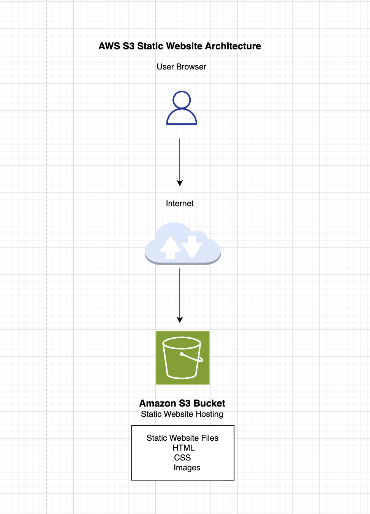

# AWS S3 Static Website Hosting Project

Static website hosted on Amazon S3 with architecture diagram and deployment documentation.

## Overview

This project demonstrates how to deploy and host a static website using Amazon S3.

The website includes HTML pages, images, and an architecture diagram hosted directly from AWS cloud infrastructure.

---

## AWS Services Used

- Amazon S3
- IAM
- Static Website Hosting

---

## Architecture Diagram

---

## Project Features

- Static website hosting using Amazon S3
- Public website access
- Architecture diagram created with draw.io
- Image asset hosting
- Cloud deployment workflow

---

## Deployment Steps

1. Created an Amazon S3 bucket
2. Uploaded website files and images
3. Enabled static website hosting
4. Configured index document settings
5. Updated bucket permissions for public access
6. Tested the website endpoint

---

## What I Learned

- Difference between object storage and block storage
- How static website hosting works in Amazon S3
- How S3 object paths and file structures work
- Basic cloud architecture diagram creation
- Cloud deployment and hosting concepts

---

## Author

Sonia Shaw  
AWS Cloud Portfolio Project
